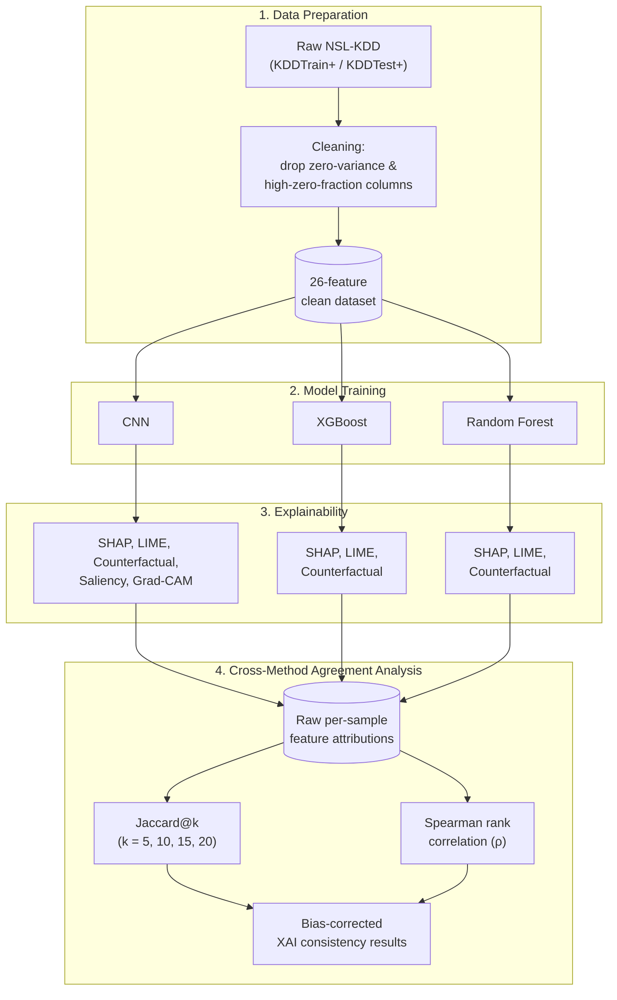

# XAI for Network Intrusion Detection — Multi-Model

Proof-of-concept comparing 5 XAI techniques across 3 model architectures on the NSL-KDD dataset. Part of PhD research on cross-domain XAI evaluation.

## What it does

Trains **three models** on NSL-KDD intrusion detection and applies XAI methods to each:

| Method | CNN (1D) | XGBoost | Random Forest |
|---|---|---|---|
| SHAP | ✓ (Kernel) | ✓ (Tree) | ✓ (Tree) |
| LIME | ✓ | ✓ | ✓ |
| Counterfactuals | ✓ (TF gradients) | ✓ (numerical) | ✓ (numerical) |
| Saliency | ✓ | — | — |
| Grad-CAM (1D) | ✓ | — | — |

Two things live in this repo: the original **baseline pipeline** (`xai_pipeline.py`) and a **staged results pipeline** that cleans the data, trains + explains, stores the XAI results in a graph database, and analyses cross-method agreement to reduce bias.

## Quick start (baseline)

```bash
python3.10 -m venv .venv-xai && .venv-xai/bin/pip install -r requirements-xai.txt
.venv-xai/bin/python src/xai_pipeline.py            # full baseline run
.venv-xai/bin/python src/xai_pipeline.py --fast     # fast dev mode
```

## Environments

Two venvs keep heavy/conflicting dependencies apart:

- **`.venv-dataprep`** (Python 3.11) — data cleaning, profiling, FalkorDB, analysis
  (`ydata-profiling`, `falkordb`, `scikit-learn`, `scipy`, `mlflow`, `setuptools<81`)
  ```bash
  python3.11 -m venv .venv-dataprep
  .venv-dataprep/bin/pip install -r requirements-dataprep.txt
  ```
- **`.venv-xai`** (Python 3.10) — model training + explainers
  (`tensorflow`, `shap==0.49.1`, `lime`, `xgboost==1.7.6`)
  ```bash
  python3.10 -m venv .venv-xai
  .venv-xai/bin/pip install -r requirements-xai.txt
  ```
  > `tensorflow-metal` (Apple Silicon GPU) is arm64-only. On Intel Macs, install
  > without it: `grep -v '^tensorflow-metal' requirements-xai.txt | .venv-xai/bin/pip install -r /dev/stdin`

Stages hand off via files, so the two envs never share a process. Run each
stage with the matching venv's `python` binary directly (no `activate`
needed) — that's what the commands below do.

> **Dependency pins matter:** `xgboost==1.7.6` + `shap==0.49.1`. XGBoost 3.x
> serializes `base_score` as a bracketed array string that SHAP's TreeExplainer
> cannot parse — pinning avoids a hard crash. 

## Project structure

```
xai-nids/
├── src/
│   ├── xai_pipeline.py           # baseline orchestrator
│   ├── data_utils.py             # NSL-KDD loading + preprocessing (COLS, ATTACKS)
│   ├── explainers.py             # all 5 XAI methods
│   ├── evaluation.py             # fidelity, consistency, cross-model comparison
│   ├── models/
│   │   ├── base.py               # ModelWrapper abstract base
│   │   ├── cnn.py                # 1D-CNN (Keras/TensorFlow-Metal)
│   │   ├── xgboost_model.py      # XGBoost classifier
│   │   └── rf.py                 # Random Forest
│   └── stages/                   # staged results pipeline (see below)
│       ├── profile_before.py     # ydata-profiling profile of raw NSL-KDD
│       ├── clean.py              # drop zero-variance + ≥95%-zero columns
│       ├── train_explain.py      # train 3 models + 5 explainers on cleaned data
│       ├── load_graph.py         # load XAI results into FalkorDB
│       └── analyze_xai.py        # Jaccard-across-k + rank correlation + heatmaps
├── data/
│   ├── raw/  (KDDTrain+.txt, KDDTest+.txt)
│   └── processed/                # clean.parquet, results.json, attributions.json,
│                                 #   sample_manifest.json, dropped_columns.json
├── reports/                      # profiling HTML + analysis heatmaps + summaries
├── results_cnn/ results_xgboost/ results_rf/   # per-model plots (auto-created)
├── cross_model_comparison.png
├── report.json
└── GRAPH_AUGMENTATION_NOTES.md   # methodology + findings for the Ch3 write-up
```

## Staged Results Pipeline (FalkorDB + YData)

A pipeline that cleans the data, runs the models + explainers, stores the XAI
**results** in a graph database, and analyses cross-method agreement. FalkorDB is
used as an **output-side results store** (persisting what the models produced) —
**not** as a feature transformer. Models train on plain tabular data; the graph
holds the explanations for querying and analysis.

### Stages

```
raw NSL-KDD
   │
   ├─▶ profile_before.py  (dataprep)  →  ydata-profiling profile of raw data
   │
   ├─▶ clean.py           (dataprep)  →  drop zero-variance + ≥95%-zero columns
   │                                      (41 → 26 features), audit record
   │                                      data/processed/clean.parquet
   │
   ├─▶ train_explain.py   (xai-nids)  →  train CNN/XGBoost/RF + 5 explainers on
   │                                      cleaned data, 100 deterministic samples
   │                                      results.json + attributions.json + manifest
   │
   ├─▶ load_graph.py      (dataprep)  →  load results into FalkorDB ('xai_results')
   │                                      Model/Method/Sample/Feature/Explanation
   │
   └─▶ analyze_xai.py     (dataprep)  →  Jaccard @k=5,10,15,20 + Spearman rank
                                          correlation, sliced all/attack/normal,
                                          heatmaps + analysis_summary_*.json
```

### Methodology



CNN receives all 5 XAI methods; XGBoost and Random Forest receive only the
3 architecture-agnostic ones (SHAP, LIME, Counterfactual). Stage 4 is the
paper's core contribution: raw attributions (not top-k sets) are stored, so
agreement is measured two ways — Jaccard@k across multiple k (avoiding a
single arbitrary threshold) and Spearman correlation over the full ranking
(catching agreement Jaccard's hard top-k cliff misses).

### Running it

Requires Docker (FalkorDB) for the graph stages.

```bash
# FalkorDB service
docker run -d --name falkordb -p 6379:6379 -p 3000:3000 falkordb/falkordb:latest
# (or: docker start falkordb)

# 1. clean (advisor-directed 95% cut)
.venv-dataprep/bin/python src/stages/clean.py --data-dir data \
    --drop-zero-frac 0.95 \
    --out data/processed/clean.parquet --dropped data/processed/dropped_columns.json

# 2. train + explain (model env)
.venv-xai/bin/python src/stages/train_explain.py \
    --clean data/processed/clean.parquet \
    --manifest data/processed/sample_manifest.json \
    --results data/processed/results.json \
    --attributions data/processed/attributions.json --n-samples 100

# 3. load results into FalkorDB
.venv-dataprep/bin/python src/stages/load_graph.py \
    --results data/processed/results.json \
    --attributions data/processed/attributions.json --graph-name xai_results

# 4. analyse (run each slice)
.venv-dataprep/bin/python src/stages/analyze_xai.py \
    --attributions data/processed/attributions.json --out-dir reports --slice all
.venv-dataprep/bin/python src/stages/analyze_xai.py --slice attack ...
.venv-dataprep/bin/python src/stages/analyze_xai.py --slice normal ...
```

Runs are tracked in **MLflow** (experiment `xai-nids-graph-augmentation`):

```bash
.venv-dataprep/bin/mlflow ui   # http://localhost:5000
```

Explore the graph at `http://localhost:3000` (graph `xai_results`), or query it
directly:

```bash
docker exec -it falkordb redis-cli GRAPH.QUERY xai_results \
  "MATCH (e:Explanation {method:'SHAP', model:'xgboost', label:1})-[a:ASSIGNS]->(f:Feature)
   RETURN f.name, avg(a.importance) AS mean_imp ORDER BY mean_imp DESC LIMIT 5"
```

### Cleaning rule

`clean.py` always drops **zero-variance (constant)** columns. With
`--drop-zero-frac 0.95` it additionally drops columns that are ≥95% zeros.
The two categories are logged separately in `dropped_columns.json`. 
On NSL-KDD the ≥95%-zero columns are largely the
**rare-attack (U2R/R2L) detectors** — dropping them is a deliberate,
documented trade-off (see findings below). 41 → 26 features.

### Unbiased agreement analysis

`analyze_xai.py` stores/reads **raw** per-feature importances, so agreement
metrics are computed on demand rather than frozen:

- **Jaccard across k = 5, 10, 15, 20** — top-k overlap at multiple thresholds
  (avoids single-k bias; k=5/k=10 are the discriminating cuts, k=20 saturates
  since 20 of 26 features = 77%).
- **Spearman rank correlation** — full-ordering agreement, catching what
  Jaccard's hard top-k cliff misses.
- **Class slices** — `all` / `attack` / `normal`, to expose class-dependent
  behaviour.

Cleaned 26-feature run, 100 stratified samples:

| model | acc | auc | attack recall | normal recall |
|---|---|---|---|---|
| cnn | 0.767 | 0.832 | 0.615 | 0.968 |
| xgboost | 0.805 | 0.969 | 0.679 | 0.971 |
| rf | 0.785 | 0.970 | 0.644 | 0.971 |

- **Attack recall (0.61–0.68) ≪ normal recall (~0.97), uniformly** across all
  three models — a data/feature effect of the 95% cut removing rare-attack
  detectors. Accuracy stays healthy, so the cost is visible only in per-class recall.
- **SHAP–LIME are the most consistent method pair** across all models (supports
  hypothesis H2: perturbation-based methods agree more with each other than with
  gradient-based methods).
- **SHAP–LIME agreement is consistently lower on attack than normal traffic** —
  the minority class is harder to *explain* consistently, not just harder to
  *detect*. Directional trend (appropriately hedged; not significance-tested).

## References

- SHAP: Lundberg & Lee (2017) — [arXiv:1705.07874](https://arxiv.org/abs/1705.07874)
- LIME: Ribeiro et al. (2016) — [arXiv:1602.04938](https://arxiv.org/abs/1602.04938)
- Grad-CAM: Selvaraju et al. (2017) — [arXiv:1610.02391](https://arxiv.org/abs/1610.02391)
- NSL-KDD: Tavallaee et al. (2009)
- FalkorDB: <https://docs.falkordb.com/>
- YData Profiling: <https://docs.profiling.ydata.ai/>
